# Frontend Developer Roadmap In 2020

> As a front-end development engineer, I try to share my growing experience.
I will keep an eye on the development of new technologies and keep abreast of them.
If you think that these can be improved in anyway, please do suggest.

## 🔥 Modern Front-End Developer

## 🔥 Nodejs Full Stack Developer

## 🤝 Contribution

> If you think that these can be improved in anyway, please do suggest.

* Open pull request with improvements
* Discuss ideas in issues

 ## ⚠ License

