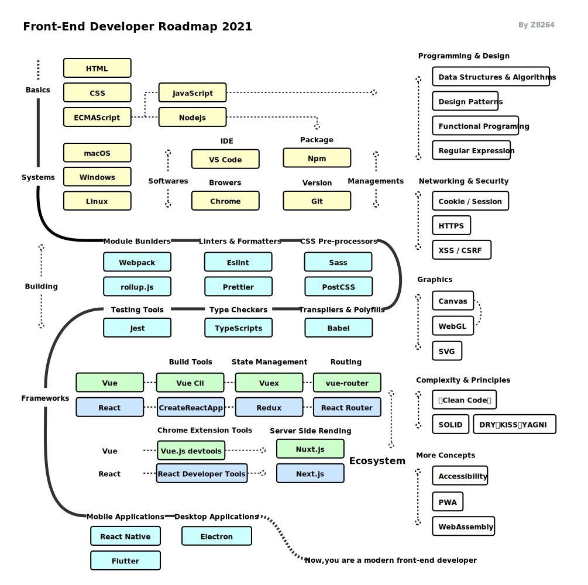
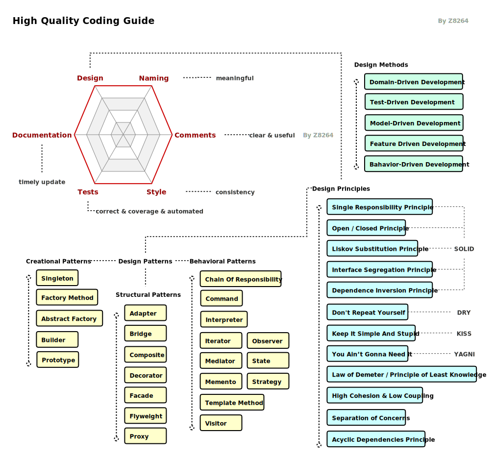

# Front-End Developer Roadmap In 2021

> This repository aims to collect the most important concepts of front-end. In order to do that, I will continue to improve this repository, so you might want to watch 🔭 this repository!

High Quality Coding Guide

* Design 
* Naming 
* Comments  
* Style 
* Tests 
* Documentation 

Recommended Books

* 《Clean Code: A Handbook of Agile Software Craftsmanship》
* 《A Philosophy of Software Design》
* 《Refactoring: Improving the Design of Existing Code (2nd Edition)》

## Contribution

If you think that these can be improved in anyway, please do suggest.

* Open pull request with improvements
* Discuss ideas in issues

## Support

> Please star ⭐️ the repository to show your support!

> Share it on Twitter or other places!

 ## License

