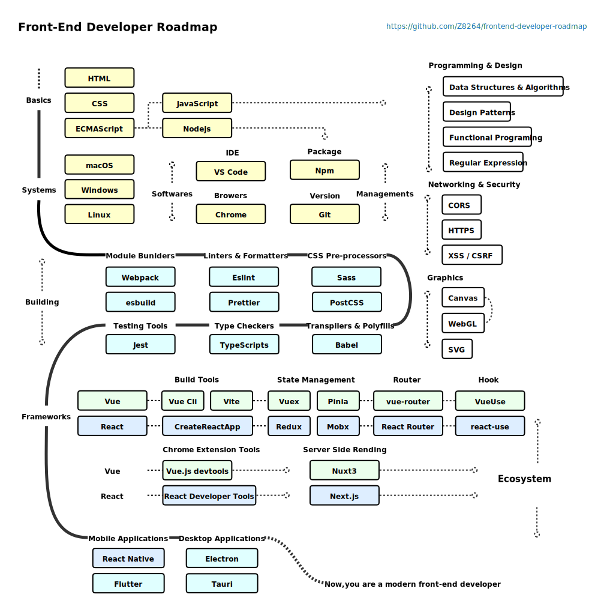
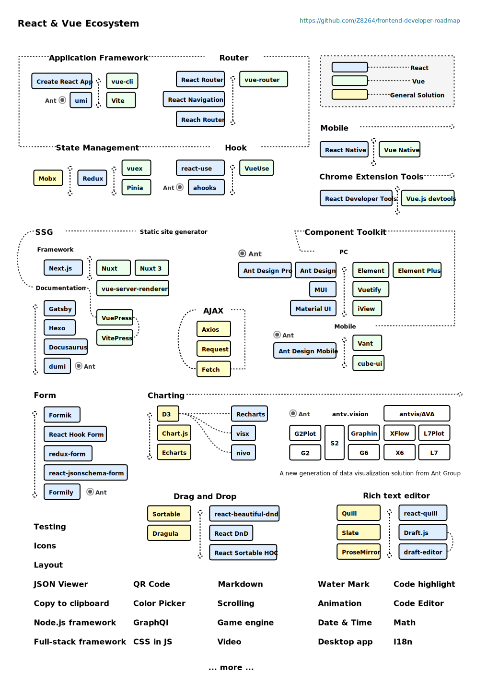
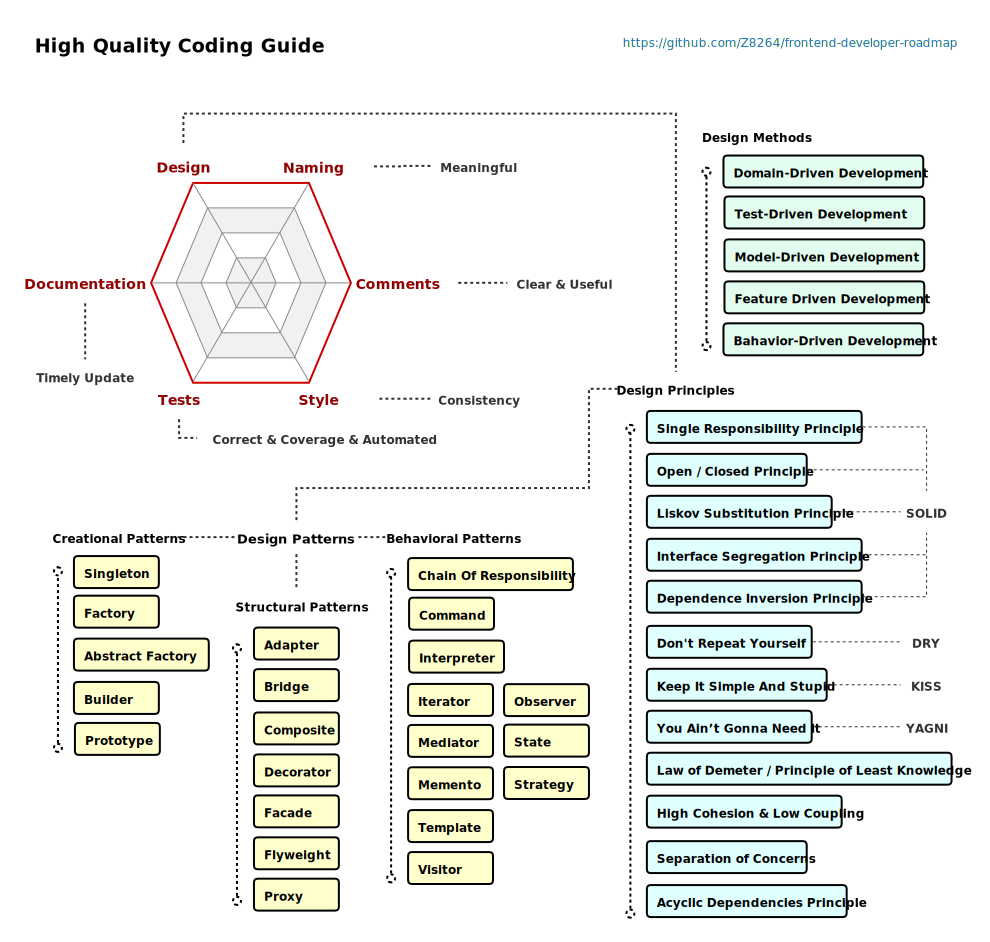

# Front-End Developer Roadmap In 2022

> This repository aims to collect the most important concepts of front-end. Next, I will build a professional front-end knowledge map to help you master front-end development.

* Front-End Developer Roadmap
* 💡 React & Vue Ecosystem
* High Quality Coding Guide
* Data Structures & Algorithms Guide

This list will continue to update… 
### Front-End Developer Roadmap

Recommended Books

* 《Professional JavaScript for Web Developers 4th Edition》
### React & Vue Ecosystem  

Recommended Project

* [bestofjs](https://bestofjs.org/)
### High Quality Coding Guide

Recommended Books

* 《Clean Code: A Handbook of Agile Software Craftsmanship》
* 《A Philosophy of Software Design》
* 《Refactoring: Improving the Design of Existing Code (2nd Edition)》

### Data Structures & Algorithms Guide

Recommended Books

* 《Introduction to Algorithms, 3rd Edition》
* 《Algorithms (4th Edition)》

## Contribution

If you think that these can be improved in anyway, please do suggest.

* Open pull request with improvements
* Discuss ideas in issues

## Support

Please star ⭐️ the repository to show your support!

Share it on Twitter or other places!

 ## License

